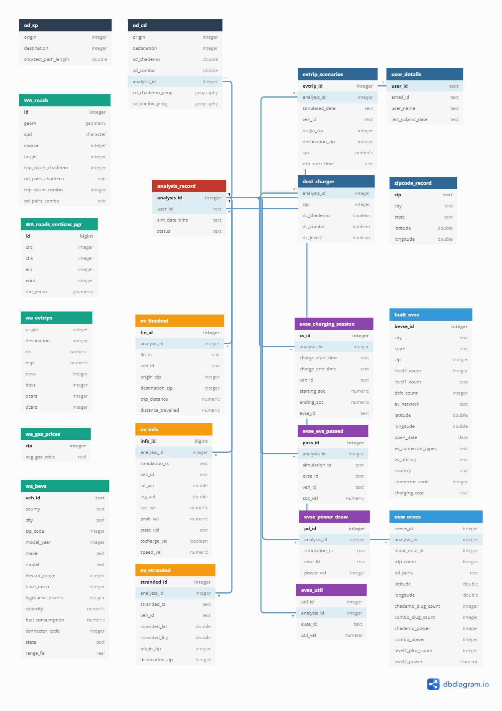

===================
System Architecture
===================

EVI-DSS is based on the model-view-controller (MVC) architecture. In the MVC architecture, the model represents the data, the view refers to the interface expose to the user and the controller handles the user requests. The architecture of EVI-DSS is as shown in :numref:`evi_dss_arch`.

 
.. _evi_dss_arch: 
.. figure:: _static/wsdot_evse_arch.jpg
    :width: 800px
    :align: center
    :alt: EVI-DSS System Architecture
    :figclass: align-center

    EVI-DSS System Architecture
	
Model
=====
The model refers to the data in the application. A relational database management system, `PostgreSQL`_ (v12.0.0) has been used as it provides geospatial capabilities through its extensions `PostGIS`_ (v 3.0) and `pgRouting`_ (v 3.0.0-alpha). The benefit of a database over files is that it enforces strict rules on data. This can help when as the complexity of the application increases and several layers depend on the same data. 

Database Overview
--------------------
The script to `create the database is here`_. The scripts to create the `tables, functions and triggers are hosted here`_. The script can be used to create the schema in the database. :numref:`evi_dss_sql` shows the various tables and relations in the database. 

.. _evi_dss_sql: 

    EVI-DSS Database Schema

Interactive diagram

.. raw:: html

    

        <iframe width="1200" src='https://dbdiagram.io/embed/5dabe2ca02e6e93440f26985'> </iframe>
    

Tables
------

1. **analysis_record**: This is the key table in the database. Every time a user submits a request to perform analysis, a record is created in this table. The auto-increment primary key :code:`analysis_id` is used to create a one-to-many relation with several tables - :code:`evtrip_scenarios`, :code:`dest_charger`, :code:`evse_charging_session`, :code:`evse_evs_passed`, 
:code:`evse_power_draw`, :code:`evse_util`, :code:`ev_stranded`, :code:`ev_finished`, :code:`ev_info`, :code:`od_cd` and :code:`new_evses`. The table also has an associated trigger :code:`notify_new_order` that generates a notification using :code:`pg_notify()`, which can be used by processes listening for a notification. In the case of EVI-DSS, this notification is picked by the controller and an analysis request is queued. More details in the controller.

2. **wa\***: 

* **WA_roads**: This table contains the geometry of the WA roads. The roads were made traversable for GAMA by using :code:`clean_network()` and then transformed to the correct SRID as explained here. Further a topology is created using the table for finding the shortest path etc.
* **WA_roads_vertices_pgr**: This is a vertices table auto-generated by pgRouting when a topology is created. 
* **wa_evtrips**: This table contains the output of the gravity model. For each origin and destination pair, the :code:`ret` and :code:`dep` column contain the number of returning and departing trips respectively. :code:`oevs` and :code:`devs` contain the count of EVs in origin and destination respectively, whereas :code:`ocars` and :code:`dcars` represent the count of total cars in the origin and destination respectively. 
* **wa_gas_prices**: This table contains the average price of gas for each zip code and should be updated periodically to get the current prices. 
* **wa_bevs**: This table contains the details about the BEVs registered in WA. This information is recieved from the WA DOL and columns like :code:`fuel_consumption` and :code:`range_fe` have been added by looking up these make and models from the fueleconomy.gov database. Column :code:`connector_code` has been added after, based on a EV manufacturer's charging standard affiliation. For example: Tesla uses Superchargers, so for all Tesla vehicles :code:`connector_code = 4`, Japanese automakers use CHAdeMO, therfore for Nissan etc. :code:`connector_code = 1`, American and German automakers use CCS, therefore for BMW etc. :code:`connector_code = 2`. 

3. **ev\***: These tables are generated by the agent-based model EVI-ABM for the EVs in the simulation - hence they use the foreign key :code:`analysis_id`.

* **ev_finished**: For each analysis, these are the EVs that have finished their respective trips. :code:`fin_ts` represents the timestamp when the trip was finished for the vehicle with ID :code:`veh_id`. :code:`trip_distance` is the length of the shortest path between :code:`origin_zip` and :code:`destination_zip` and the :code:`distance_travelled` represents the actual distance travelled by the EV in the GAMA simulation which could include charging detours. Therefore, :math:`distance\_travelled >= trip\_distance`. Additional constraint is that combination of :code:`veh_id` and :code:`analysis_id` is unique, i.e. for analysis, a vehicle can make only one trip and hence appear in this table only once. 

* **ev_info**: This table stores the EV info for each simulation at each timestamp. This is useful for debugging the simulation and writing to this table can be omitted once we have enough confidence in the simulation logic. This table can be deleted if the database is becoming too large. However, this will affect tabs "finished" and "stranded" in the *result viewer*. The EV info stored for the timestep :code:`simulation_ts` includes - the latitude, longitude, SOC, state, probability of charging (calculated using the charging choice decision model), to_charge boolean (probability passed to a binomial draw ultimately deciding whether the EV will charge at a charging station), and speed of the vehicle in the simulation. 

* **ev_stranded**: This table stores the record of all the EVs stranded during the simulation, i.e. they were out of charge. This could happen, if no charging stations were available when the charge was needed. This is an indication of insufficent charging infrastructure. :code:`stranded_ts` is the timestamp when the EV was stranded. Redundant columns :code:`origin_zip` and :code:`destination_zip` added to ease the lookup, where as redundant columns :code:`stranded_lat` and :code:`stranded_lng` could be helpful to pin-point the exact location where the EV was out of charge, and useful if the table :code:`ev_info` was eliminated. 

4. **evse\***: These tables are generated by the agent-based model EVI-ABM for the EVSEs in the simulation - hence they use the foreign key :code:`analysis_id`. The agent-based simulation (aka simulation in the documentation) treats all charging stations - built as well as new alike. The field :code:`evse_id` is generated in GAMA using 

**evse_charging_session**: This table records all the charging sessions during a simulation. Additional constraint could be the combination of :code:`analysis_id`, :code:`veh_id` and :code:`evse_id` should be unique, i.e. a vehicle may not charge at the same charging station twice during a particular simulation.

**evse_evs_passed**: This table records all the EVs that passed a charging station since it was occupied. :code:`soc_val` records the SOC of the vehicle when it passed the said charging station. This is an important statistic currrently to denote EV infrastructure insufficiency and may change as a more sophisticated queueing model is implemented in GAMA.

 

.. _PostgreSQL: https://www.postgresql.org/about/news/1976/
.. _PostGIS: https://postgis.net/2019/07/01/postgis-3.0.0alpha3/
.. _pgRouting: https://docs.pgrouting.org/latest/en/index.html
.. _here: 
.. _create the database is here:
.. _tables, functions and triggers are hosted here: