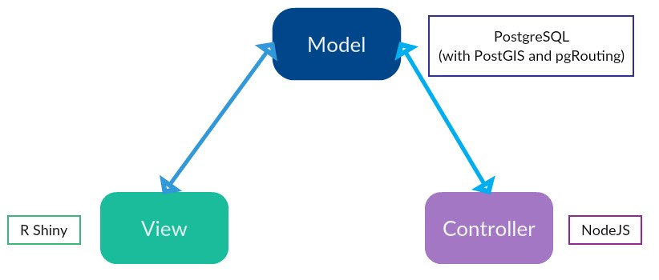

===================
System Architecture
===================

EVI-DSS is based on the model-view-controller (MVC) architecture. In the MVC architecture, the model represents the data, the view refers to the interface expose to the user and the controller handles the user requests. The architecture of EVI-DSS is as shown in :numref:`evi_dss_arch`.

 
.. _evi_dss_arch: 

    EVI-DSS System Architecture
	
Model
=====
The model refers to the data in the application. A relational database management system, `PostgreSQL`_ (v12.0.0) has been used as it provides geospatial capabilities through its extensions `PostGIS`_ (v 3.0) and `pgRouting`_ (v 3.0.0-alpha). The benefit of a database over files is that it enforces strict rules on data. This can help when as the complexity of the application increases and several layers depend on the same data. 

 

.. _PostgreSQL: https://www.postgresql.org/about/news/1976/
.. _PostGIS: https://postgis.net/2019/07/01/postgis-3.0.0alpha3/
.. _pgRouting: https://docs.pgrouting.org/latest/en/index.html
