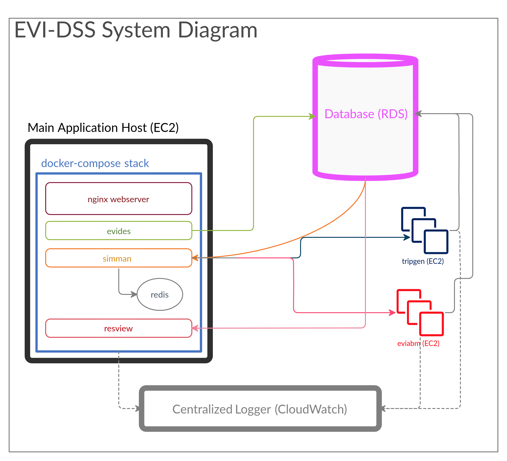
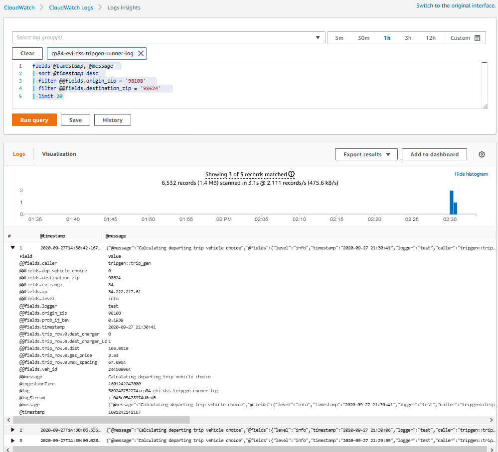
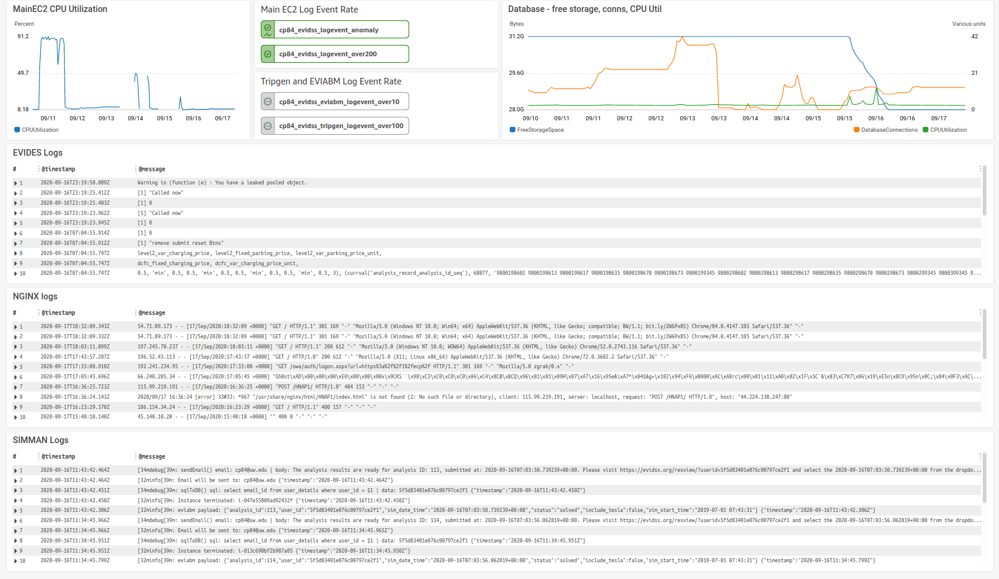

===================
System Architecture
===================

EVI-DSS is based on the model-view-controller (MVC) architecture. In the MVC architecture, the model represents the data, the view refers to the interface(s) exposed to the user and the controller handles the user requests. The architecture of EVI-DSS is as shown in :numref:`evi_dss_arch`.

 
.. _evi_dss_arch: 
.. figure:: _static/wsdot_evse_arch.jpg
    :width: 800px
    :align: center
    :alt: EVI-DSS System Architecture
    :figclass: align-center

    EVI-DSS System Architecture
	
Model
=====
The model refers to the data in the application. A relational database management system, `PostgreSQL`_ (v12.0.0) has been used as it provides geospatial capabilities through its extensions `PostGIS`_ (v 3.0) and `pgRouting`_ (v 3.0.0-alpha). The benefit of a database over files is that it enforces strict rules on data. This can help when as the complexity of the application increases and several layers depend on the same data. 

Read :ref:`database:Database` for details about the database.

View
====
The view refers to the interface exposed to the users of EVI-DSS. The users interact with the views. EVI-DSS has two views - the :ref:`evi_des:EV Infrastructure Designer (evides)` can be used to select the locations of prospective charging stations and configure the details for the charging stations placed; and the :ref:`res_view:Results Viewer (resview)` can be used to view to the results of the simulation for the current EV infrastructure, which is the combination of built as well as proposed charging stations. 

Controller
==========
The controller is the application that manages the execution of a simulation process when a new analysis request is made. Due to the multi-user nature of EVI-DSS, many users may simultaneously submit analysis execution requests. The controller queues the analysis requests and allocates the available resources. 

Read :ref:`sim_man:Simulation Manager (simman)` for more details about the controller. 

Benefits of MVC Architecture
============================
MVC is a popular architecture for complex applications. The benefit in our case, is that we can deploy all the component applications of EVI-DSS namely the database, the EV Infrastructure Designer, the Results Viewer and Simuilation Manager on one machine, or we can deploy it across several machines allowing to scale the application as needed. Modular nature of EVI-DSS allows us to maintain the application with ease, and a develop can work on one component without affecting the others. This also makes deployment easier, as the components can all be containerized. 

.. .. warning::
    It would be prudent to note that EVI-DSS currently is not robust to database failure. So, if the database crashes, the processes depending on them are likely to crash or mis-behave. This is high on the wish-list along with reducing execution time for analysis.

System Diagram
==============
    
:numref:`evi_dss_sys_diagram` shows the EVI-DSS System Diagram. 

.. _evi_dss_sys_diagram: 

    EVI-DSS System Diagram

.. Design Motivation
   -----------------

Deployment
==========

EVI-DSS can be readily deployed on an AWS EC2 instance using :code:`docker-compose`. The docker-compose `script is located here`_. 

Services
--------

- :code:`nginx`: The Nginx webserver is used as a reverse proxy for the R Shiny applications :code:`evides` and :code:`resview`. 

- :code:`evides`: :ref:`evi_des:EV Infrastructure Designer (evides)` is the R Shiny app with authentication for submitting new EVSE deplopyment scenarios. These scenarios get recorded in a database. 

- :code:`simman`: This micro-service, the :ref:`sim_man:Simulation Manager (simman)` is the NodeJS application responsible for managing the submitted analysis requests.

  * :code:`tripgen`: :code:`simman` programmatically launches an EC2 instance for :ref:`trip_gen:Trip Generation (tripgen)`. Upon trip generation, the EC2 instance is terminated. 

  * :code:`eviabm`: The :ref:`evi_abm:EV Infrastructure Agent-based Model (eviabm)` simulates the EV and EVSE agents and runs in its dedicated EC2 instance which is terminated after the simulation is over.

- :code:`redis`: The Redis server is used to as the storage for analysis request queue, used by :code:`simman`.

- :code:`resview`: The :ref:`res_view:Results Viewer (resview)` is the R Shiny application for viewing the results of the simulation. It shows summary statistics as well as agent states at every minute of the simulation. 

- :code:`flyway`: This service can be executed to implement database migrations. 

To start a docker container after making a change, use the following command to recreate the container (will take some time to execute):

.. code-block:: bash

   $ docker-compose up -d --build --force-recreate <container-name(s)> 

Replace <container-name(s)> with the name(s) of the docker container you wish to start, for example, :code:`evides`, :code:`nginx` etc. 

To start a stopped container, or restart a container without re-building it, but update environment variables, use the following command:

.. code-block:: bash

   $ docker-compose up -d <container-name> 

To log into a specific container for debugging etc. use the following command: 

.. code-block:: bash

   $ docker exec -it <container-id> /bin/bash 

AWS-Specific Settings
^^^^^^^^^^^^^^^^^^^^^

It is suggested that the script be launched in an instance of type t3a.medium (2 vCPUs, 4 GB RAM) or larger. Other AWS-sepcific settings include:

- **IAM Policies**: A new IAM role can be created by attaching the following policies to the EC2 instance with the docker-stack:
    
  * Send logs to CloudWatch: To be able to send logs from the instance using the `AWS CloudWatch agent`_, attach the pre-existing IAM policy: :code:`CloudWatchAgentServerPolicy`.

  * Send emails using Amazon SES: To be able to send emails using the Amazon Simple Email Service (SES), attach the pre-existing policy: :code:`AmazonSESFullAccess`.

  * Create EC2 Instances (of certains types only): This can be achieved by attaching an IAM policy like one shown below (`detailed explanation`_):

.. code-block:: json

  {
    "Version": "2012-10-17",
    "Statement": [
        {
            "Sid": "VisualEditor0",
            "Effect": "Allow",
            "Action": [
                "ec2:Describe*",
                "ec2:GetConsole*"
            ],
            "Resource": "*"
        },
        {
            "Sid": "VisualEditor1",
            "Effect": "Allow",
            "Action": [
                "ec2:TerminateInstances",
                "ec2:DeleteTags",
                "ec2:CreateTags",
                "ec2:RunInstances",
                "ec2:StopInstances"
            ],
            "Resource": [
                "arn:aws:ec2:*:*:key-pair/*",
                "arn:aws:ec2:*:*:instance/*",
                "arn:aws:ec2:*:*:subnet/*",
                "arn:aws:ec2:*:*:volume/*",
                "arn:aws:ec2:*:*:security-group/*",
                "arn:aws:ec2:*:*:network-interface/*",
                "arn:aws:ec2:*::image/*"
            ]
        },
        {
            "Sid": "VisualEditor2",
            "Effect": "Deny",
            "Action": "ec2:RunInstances",
            "Resource": [
                "arn:aws:ec2:*:*:subnet/*",
                "arn:aws:ec2:*:*:instance/*",
                "arn:aws:ec2:*:*:volume/*",
                "arn:aws:ec2:*:*:security-group/*",
                "arn:aws:ec2:*:*:network-interface/*",
                "arn:aws:ec2:*::image/*"
            ],
            "Condition": {
                "ForAnyValue:StringNotLike": {
                    "ec2:InstanceType": [
                        "t2.nano",
                        "t2.small",
                        "t2.micro",
                        "t2.medium",
                        "t2.large"
                    ]
                }
            }
        },
        {
            "Effect": "Allow",
            "Action": "iam:PassRole",
            "Resource": "*"
        }
    ]
  }

Observability
-------------

Observability is the capability to be aware of the system and take quick remedial action in case of failures, errors etc. and is critical for distributed, scalable applications. The three main pillars of observability include:

Logging
^^^^^^^
EVI-DSS uses AWS CloudWatch as centralized log destination for all systems. Logs are sent from docker containers (evides, simman, resview, redis, nginx, flyway, tripgen) as well as from the launched EC2 instances tripgen and eviabm. Using a centralized log destination allows for log persistance and long term analytical capabilities. The :code:`tripgen` logging allows for debugging, using queries. For example, the query below shows results in the log entry for origin = 98108, and destination = 98624, shown in :numref:`cw_insight_odtripgen`.The factors that affect the vehicle choice can be examined to verify their validity. 

.. code-block:: sql

  fields @timestamp, @message
  | sort @timestamp desc
  | filter @@fields.origin_zip = '98108'
  | filter @@fields.destination_zip = '98624'
  | limit 20

.. _cw_insight_odtripgen: 

    CloudWatch Logs Insight Example

Monitoring
^^^^^^^^^^
- AWS CloudWatch Dashboard - :numref:`evi_dss_sys_diagram` shows the EVI-DSS CloudWatch Dashboard. The dashboard shows the plot of average CPU utilization of the main EC2 instance, status of alarms, plot of database metrics like CPU utilization, number of database connections, free storage space, as well as logs from :code:`evides`, :code:`nginx` and :code:`simman`. 

.. _evi_dss_cw_dashboard: 

    EVI-DSS CloudWatch Dashboard

- dockprom: `dockprom`_ gives fine grained statistics for all the docker containers on the system. 

- pgAdmin: pgAdmin's in-built dashboard allows insight into the database and can be used to see the number of active connections as well as transaction metrics. 

- AWS EC2 Dashboard: The AWS EC2 dashboard provides basic monitoring capabilities on the launched EC2 instances, namely the number and specification of the launched instances as well as coarse system metrics like CPU and memory utilization. 

- ssh: All the EC2 instances have ssh access which means a user can log in and view the system state and debug it as needed. 

Distributed Tracing
^^^^^^^^^^^^^^^^^^^
Currently, no instrumentation exists in the system that directly shows the trace of an analysis request, i.e. which step of the process is currently executing. But since, the simulation manager is controlled by the three triggers, namely, :code:`notify_new_order()`, :code:`notify_trips_generated()` and :code:`notify_solved()`, observing the database for status changes alongwith the audit trigger on the :code:`analysis_record` table gives us an indication of the step. 

.. _dockprom: https://github.com/stefanprodan/dockprom
.. _script is located here: https://github.com/chintanp/evi-dss/blob/master/docker-compose.yml
.. _PostgreSQL: https://www.postgresql.org/about/news/1976/
.. _PostGIS: https://postgis.net/2019/07/01/postgis-3.0.0alpha3/
.. _pgRouting: https://docs.pgrouting.org/latest/en/index.html
.. _detailed explanation: https://github.com/chintanp/cloudsecurity/blob/master/AWS/Guides/limiting_ec2_instance_types.md
.. _AWS CloudWatch agent: https://docs.aws.amazon.com/AmazonCloudWatch/latest/monitoring/Install-CloudWatch-Agent.html