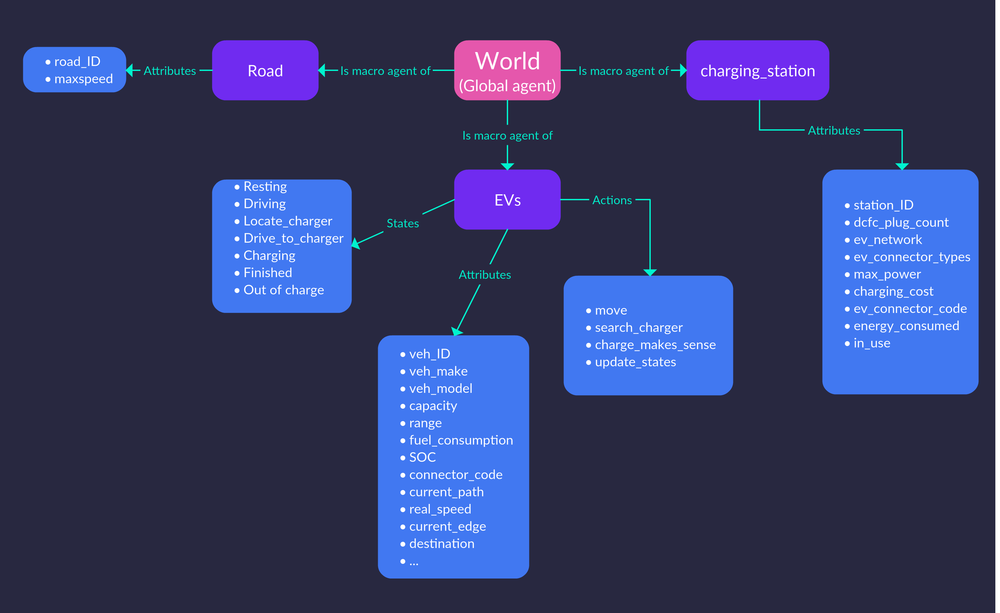
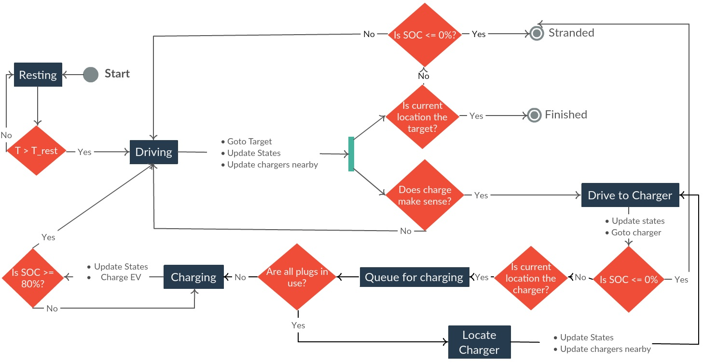

============================================
EV Infrastructure Agent-based Model (eviabm)
============================================

The agent-based model is implemented in `GAMA`_. GAMA was considered suitable for this project as it supports spatially explicit agent-based models. Some other features include: 

- A high-level language with several data-structures and programming constructs. 

- An advanced eclipse-based integrated development environment supporting auto-complete and in-simulation agent state viewer. 

- A graphical user interface (GUI) for viewing and interacting with the simulations. 

- External interfacing capabailities including connections to a database. 

- The ability to operate in a headless mode (as a background application without GUI) on multiple operating systems. 

- Vibrant community and active support through google groups and github issues. 

- Detailed documentation and examples covering several applications and usecases. 

EVI-ABM System Overview
-----------------------

The EVI-ABM system overview is shown in :numref:`evi_abm_sys_diagram`. We see that all agents, EVs, charging stations, and roads are children of the global agent “World”. All agents have attributes and possibly actions and states, which together define the agent’s characteristics. Some of these are built-in like location and speed, while some are user-defined like vehicle ID, capacity etc. :numref:`evi_abm_sys_diagram` shows the object-oriented nature of a GAMA model, and intuitively transfers to the real world. Depending on the problem at hand, we can define agents in as much detail as we choose. 

.. _evi_abm_sys_diagram: 

    
    EVI-ABM System Diagram

Finite State Machine Control
----------------------------

Finite state machine (FSM) is a commonly used control paradigm and divides the system into several states and transitions. Agents begin the simulation in a certain state and transition into any (one of the) other states when a certain condition is fulfilled. It is important to note that, at any time-step agents can be in only one state.

FSM control is suitable to model the EV operation as we have deterministic and finite states the vehicle can be in (resting, driving, charging). The benefit of FSM control for our use case is that it helps in managing the complexity of operation and allows for easy testing. While modeling the infrastructure and driver behavior, FSM control allows us to observe in which state our agents are at any time step of the simulation and hence, we can get greater observability aiding in debugging. FSM control is also flexible, i.e. if we decide to add more complexity to the operation by adding more states (e.g. waiting in queue); we can do that by changing the transition conditions. The state diagram for our system is shown in :numref:`evi_abm_state_diagram`

.. _evi_abm_state_diagram: 

    Finite state machine diagram for EVI-ABM

To parse the state diagram, first observe the start and finished states. Other states in the system are “Resting”, “Driving”, “Locate Charger”, “Drive to Charger”, "Queue for Charging" and “Charging”, dark rectangular blocks. These are connected to diamond shaped decision boxes, that are the transition conditions, and the statements above the connecting lines are actions, or behaviors that are undertaken by agents at every time step, like “Go to Target”, “Update States” etc. While some decision questions like “Is T > T_rest?”, or “Is current location the target?” are easily answered in the ABM framework; some other EVI-ABM specific decision questions like “Does charging make sense?” are not so directly answerable and will depend on the trip and car related conditions as well as individual preferences. The linkages between these conditions and preferences are captured in behavioral models. 

.. warning::
    The agent-based model (eviabm) only considers a constant charging rate of 50kW for each EV - since the `fueleconomy.gov` website used for collecting vehicle information does not contain information about maximum charge power for an EV. It also considers all chargers to be charging at 50 kW too, since AFDC does not maintain charging station maximum charging power information. This was not much of an issue when most vehicles allowed only 50 kW and most CHAdeMO and COMBO chargers allowed 50 kW too. With Electrify America charging stations, however, and advent of ultra-fast charging - the model will have to be updated to consider vehicle / charger specific charging rates. 

    .. _GAMA: https://gama-platform.github.io/