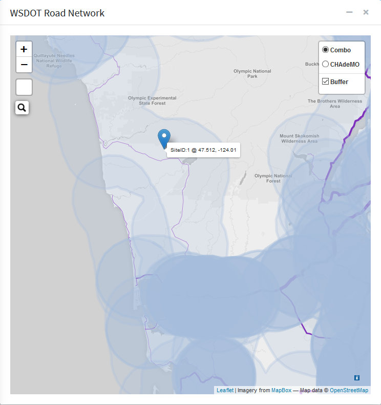
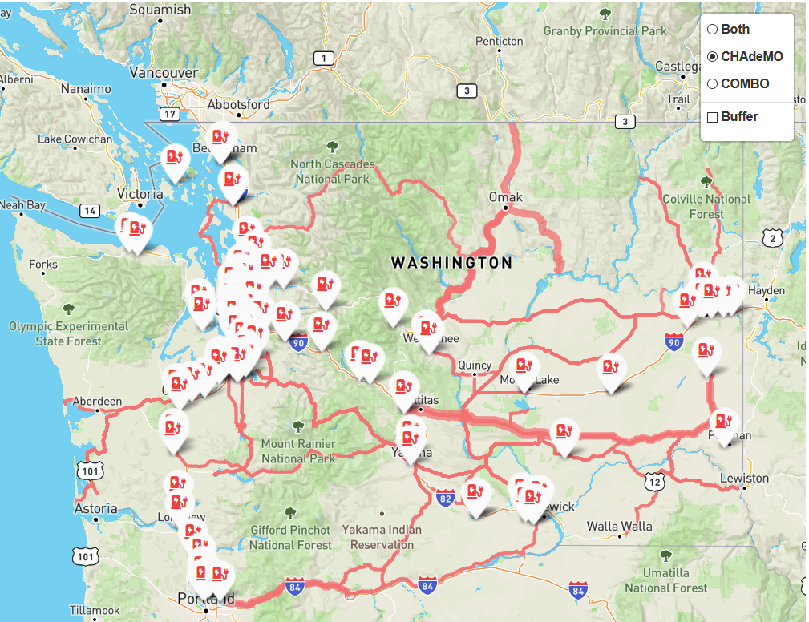
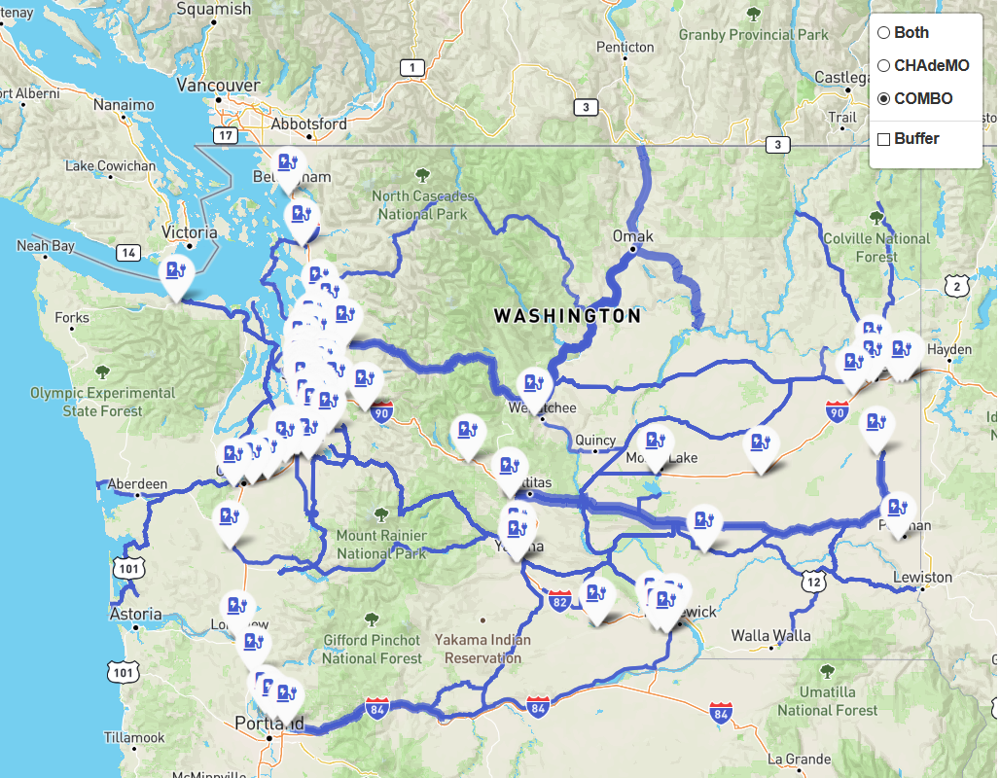
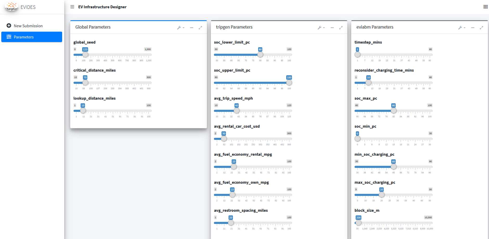
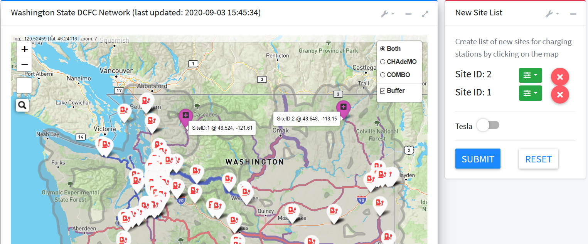
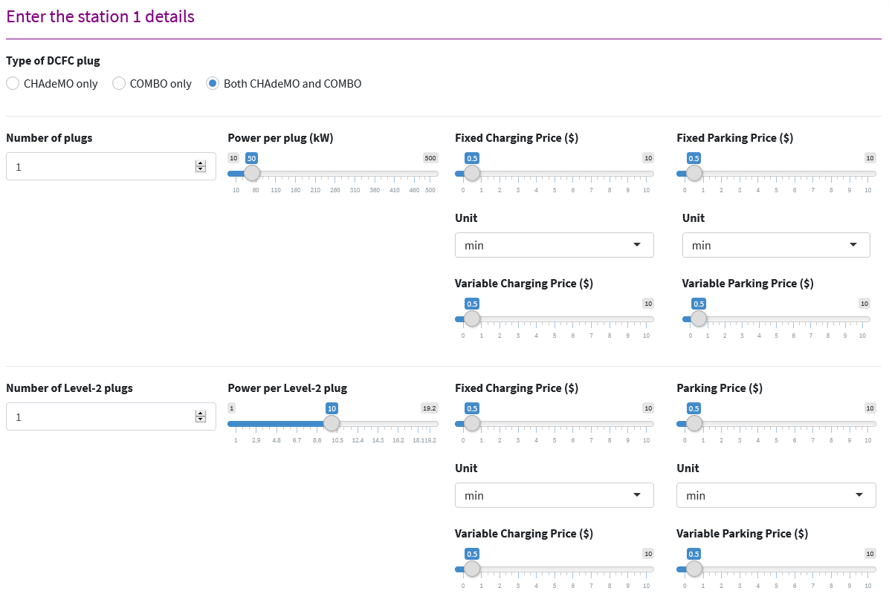

.. _evi_des:

===================================
EV Infrastructure Designer (evides)
===================================

The EV Infrastructure Designer is the user-interface (UI) for inputting the location, type, count etc. details about the prospective charging stations. The video shows a demonstrative use of :code:`evides`. 

.. raw:: html

    <iframe width="560" height="315" src="https://www.youtube.com/embed/bBJi0hEugR4" frameborder="0" allow="accelerometer; autoplay; encrypted-media; gyroscope; picture-in-picture" allowfullscreen></iframe>

Live Demo
=========
`Click here`_ to access the live demo of EVI Designer.

UI Details
==========

After logging in by providing email-id and password, the user is greeted with :numref:`evi_des_home`. 

.. _evi_des_home: 
.. figure:: _static/evides_home.png
    :width: 800px
    :align: center
    :alt: EV Infrastructure Designer 
    :figclass: align-center
    
    EV Infrastructure Designer 

The key elements of the EV Infrastructure Designer are as under:

Washington State DCFC Network 
-----------------------------
The "Washington State DCFC Network" card shows the WSDOT road network overlayed with the infeasibility metric for CHAdeMO and COMBO charging alongwith the as-built EV DCFC infrastructure - selectable from the radio buttons on the upper right corner as in :numref:`wsdot_road_network` . Besides the infeasibility overlay, the radio buttons also show the relevant type of charging stations on the road network. These locations are consistent with the database table :code:`built_evse`. 

.. _wsdot_road_network: 

    
    Washington State DCFC Network with overlay

Trip Infeasibility
******************

Concept
^^^^^^^

The infeasibility metric is an indication of sparsity of EV infrastrastructure on a path. A count is calculated for the total vehicle trips passing over a road segment belonging to a shortest path between an OD pair if the spacing between charging stations on the segment is greater than 70 miles (critical limit specified by WSDOT). The line weight of the overlay is directly proportional to the trip count passing over a segment. So, a thick overlay can mean that a high count of vehicles are passing over the segment. The low line weight indicates light traffic on the segment. The former indicates that the road segment is used by several OD pairs in the state, whereas the later indicates the vice-versa. No line weight on the roads mean that the charging station spacing on the segment is less than 70 miles. There are separate overlays for CHAdeMO and COMBO charging stations as not all charging stations feature both types of plugs. 

Algorithm
^^^^^^^^^

The script for calculating the `trip infeasibility is here`_. The basic algorithm is as follows:

- For each zip code combination in the state, find the shortest path on the WA road network. This utilizes the SQL function :code:`sp_od2()` `shown here`_. 
- Then all the charging stations within 10 miles of the shortest path are found using PostGIS function :code:`ST_DWithin()`. 
- Ratios are found between 0 and 1, where the point closest to these charging stations lie on the shortest path using PostGIS function :code:`ST_LineLocatePoint()`. This means the origin has ratio 0.0 and destination has ratio 1.0, and charging stations along the route have ratios between 0 and 1 depending on whether they are near origin or destination respectively. 
- After sorting the ratios, the successive differences in ratios are found using SQL function :code:`lag()`. 
- Multiplying the lags with the length of the shortest path, gets us (on-route) spacings between successive charging stations. 
- We then filter out, all the ratios for which the spacings are less than 70 miles, since that is the critical distance between charging stations. Spacings greater than 70 miles represent the infeasible sections of the shortest path.
- Then we find the geometry for these spacings, using PostGIS function :code:`ST_LineSubString()` using the shortest path as the line, and (ratio - lag), ratio as the start and end fraction for the substring respectively. 0 and 1 are added to ensure that we get the first and last segment as well. 
- All these geometries, that are longer than 70 miles in length, are inserted in the :code:`trip_infeasibility` table in the database. If the geometry already exists, then the corresponding :code:`trip_count` is added to the new trip_count. To figure whether geometry already exists in the database, a unique index is added on the :code:`md5()` encoded value of geometry, as per the `recommendation here`_. This can be `upgraded to SHA512`_ for a better uniqueness guarantee. 
- This process is repeated for all the OD pairs in our dataset and for both COMBO and CHAdeMO plug-type. 
- It currently takes around 12 hours for this algorithm to calculate trip infeasibility with over 300k+ OD pairs. 

Plotting
^^^^^^^^
The above algorithm resulted in a geometry table with 6000+ rows and size 700 MB+. While this data is not too much for the database, it is pretty large to load on a web-page in a reasonable amount of time. Therefore, the vector dataset was converted to `vector tilesets`_, a `MapBox open specification`_. The following methodology was used to generate a fast loading map showing this data: 

- The geometry table(s) was used to generate the dataset in the GeoJSON format, using a GDAL utility `ogr2ogr`_, like so : 

.. code-block:: bash

    ogr2ogr -f GeoJSON <name_output_file.json> "PG:host=<db_host> dbname=<db_name> user=<db_user> password=<db_password>"  -sql "select trip_count, geom from trip_infeasibility"

- The resulting GeoJSON file, still around 800MB is too big for `Mapbox dataset limit`_. Therefore, Mapbox utility `tippecanoe`_ is used to convert the GeoJSON dataset to Mapbox tileset, like so:

.. code-block:: bash

    tippecanoe -o <output_filename.mbtiles> <input_geojson_file.json> 

- The resulting tileset is significantly small (~12 MB) and can be uploaded to the Mapbox tileset repository with ease using the `mapbox studio tilesets page`_.

- This tileset is then used to create a custom style. To create a custom style, start with a blank style, and add the uploaded tileset as layer and change the line width of the resulting line "Style across data range", data being trip_count. A line width of 0 is chosen when trip_count is 0 and line with of 10px is chosen for the maximum value of trip_count and default linear transition in between.

- The above method is used to generate trip infeasibility overlays for both COMBO and CHAdeMO plug types. The styles are transparent and therefore need to be overlaid on other tiles for context. 

Trip Infeasibility - CHAdeMO
^^^^^^^^^^^^^^^^^^^^^^^^^^^^
The trip infeasibility for the CHAdeMO network can be seen in :numref:`trip_inf_chademo`. 

.. _trip_inf_chademo: 

    
    Trip Infeasibility for CHAdeMO Network

Trip Infeasibility - COMBO
^^^^^^^^^^^^^^^^^^^^^^^^^^

The trip infeasibility for the COMBO network can be seen in :numref:`trip_inf_combo`. 

.. _trip_inf_combo: 

    
    Trip Infeasibility for COMBO Network

Buffer
******

The checkbox called "Buffer" toggles the display of a buffer around the road network. This buffer spans a length of 10 miles around the roads, and represent the feasible area for the location of prospective charging stations. The length of 10 miles is an indicator of the willing of an EV driver to divert from the road to charge. 

:numref:`wsdot_road_network` shows a selected charger location with a marker. The UI will only allow charger placement in the buffer region around the roads and the successful click results in a marker as shown. As many charging station locations can be picked as desired. 

Parameters
----------
It is now also possible to set the simulation parameters from the EVIDES UI from the "Parameters" tab by adjusting the sliders as can be seen from :numref:`params_tab`. 

.. _params_tab: 

    
    Parameters Tab

New Site List
-------------
The New Site List card lists all the chosen sites with options to configure or cancel the selection as shown in :numref:`new_site_list_closed`. 

.. _new_site_list_closed: 

    
    New Site List

For all the selected locations, configuration can be done as shown in :numref:`station_config`. 

.. _station_config: 

    
    Station Configuration

The station configuration modal allows the setting of number of plugs for DCFC and Level-2 as well as the corresponding power per plug and pricing structure. Total price can include charging price and parking price. For both parking and charging, there could be a fixed component (per session) and variable (per minute) component. 

Once satisfactory counts of charging stations with appropriate configuration have been selected, the selection can be submitted for analysis by clicking the "Submit for analysis" button. This will insert a record in the database table :code:`analysis_record`, which will trigger an analysis request to the simulation manager. A successful analysis submission will also insert rows in the table :code:`new_evses` for the respective :code:`analysis_id`. As many rows as the number of charging sites selected will be entered with the columns like plug count, power, price etc. as per the individual configuration.

.. note::
    The user can bring down the count of plugs all the way to zero. When DCFC plug count is set to zero for all new charging stations, the analysis is equivalent to the as-built scenario. This, therefore, is the way to get to the base-case analysis and the new charging station deployment scenarios can be compared against the base-case. 

The New Site List card then displays a successful analysis submission message with the submission date time as shown in :numref:`submitted_analysis`. Since the analysis process involving re-calculation of destination chargers, charging distances, EV trips and subsequent agent-based simulation is a computationally-intensive long process, taking several hours at the time of this writing, the user is informed about the successful completion of analysis via an email at the registered email address. The results can then be viewed for the particular simulation date time of interest. 

.. _submitted_analysis: 
.. figure:: _static/submit_success_msg.png
    :align: center
    :alt: Analysis Submission View
    :figclass: align-center

    Analysis Submission View

Implementation Details 
======================
The EV Infrastructure Designer is a web-app with an R Shiny backend. The code is hosted in the Github repo - `ev_infrastructure_designer`_. 

User Identity
-------------
`Auth0`_ is used for user-identity management. It allows for authentication across devices and browsers using custom email/password as well as several external authentication services like Google, Github etc. allowing of easy sign-on. The integration of Auth0 with the R Shiny app was facilitated by the `R package auth0`_ that implements the Auth0 API in R. 

.. Environment Variables
------------------------
The application depends on several environment variables. A template :code:`.Renviron` file is `here`_. The :code:`AUTH0*` variables allow access to AUTH0. The AFDC API key allows access to the information about charging stations. :code:`MAPBOX_ACCESS_TOKEN` allows access to the MapBox service that is responsible for the map tiles. The variables :code:`MAIN*` are related to the database. The database environment variables have to be consistent across the EV Infrastructure Designer, Results Viewer and Simulation Manager, so they all access the same database. 

.. _ev_infrastructure_designer: https://github.com/chintanp/ev_infrastructure_designer
.. _Auth0: https://auth0.com/
.. _R package auth0: https://github.com/curso-r/auth0
.. _here: https://github.com/chintanp/ev_infrastructure_designer/blob/master/.Renviron_template
.. _Click here: https://cp84.shinyapps.io/evi_des/
.. _trip infeasibility is here: https://github.com/chintanp/wsdot_evse_update_states/blob/awspack/R/update_trip_inf.R
.. _shown here: https://github.com/chintanp/evi-dss/blob/5e6579e668f70db58a0a834aae06bc8f1319be7b/database/migrations/V1__base_version.sql#L67
.. _recommendation here: https://dba.stackexchange.com/a/94228/53079
.. _vector tilesets: https://docs.mapbox.com/vector-tiles/reference/
.. _Mapbox open specification: https://docs.mapbox.com/vector-tiles/specification/
.. _ogr2ogr: https://gdal.org/programs/ogr2ogr.html
.. _Mapbox dataset limit: https://docs.mapbox.com/help/troubleshooting/uploads/#accepted-file-types-and-transfer-limits
.. _tippecanoe: https://github.com/mapbox/tippecanoe
.. _mapbox studio tilesets page: https://studio.mapbox.com/tilesets/
.. _upgraded to SHA512: https://dev.to/rhymes/how-to-build-unique-indexes-in-postgresql-on-large-text-3e6d