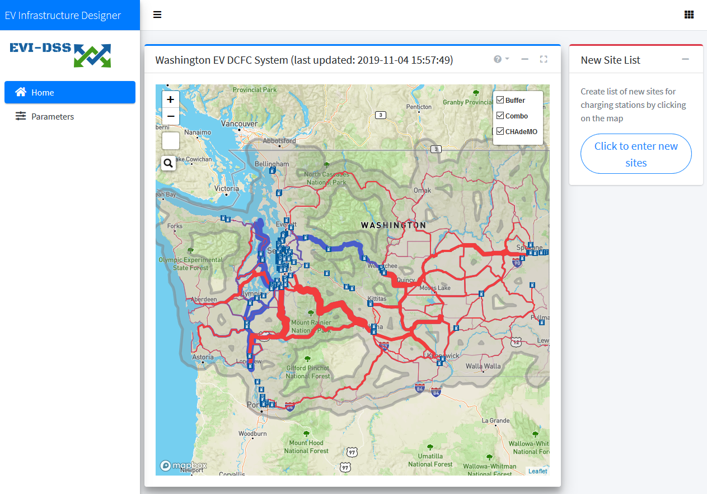
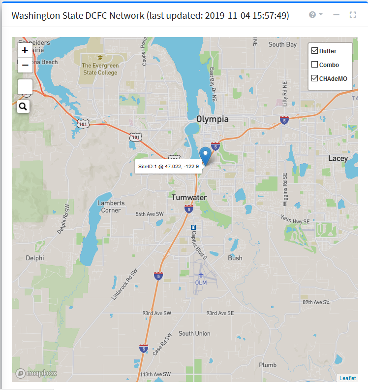

==========================
EV Infrastructure Designer
==========================
The EV Infrastructure Designer is the user-interface (UI) for inputting the location, type, count etc. details about the prospective charging stations. After logging in by providing email-id and password, the user is greeted with :numref:`evi_des_home`. 

.. _evi_des_home: 

    
    EV Infrastructure Designer 

UI Details
==========
The key elements of the EV Infrastructure Designer are as under:

WSDOT Road Network 
------------------
The WSDOT Road Network card shows the WSDOT road network overlayed with the infeasibility metric for CHAdeMO and COMBO charging - selectable from the radio buttons on the upper right corner as in :numref:`wsdot_road_network`. Besides the infeasibility overlay, the radio buttons also show the relevant type of charging stations on the road network. These locations are consistent with the database table :code:`built_evse`. 

.. _wsdot_road_network: 

    
    WSDOT Road Network

The infeasibility metric is an indication of sparsity of EV infrastrastructure on a path. A count is calculated for the total vehicle trips passing over a road segment belonging to a shortest path between an OD pair if the spacing between charging stations on the segment is greater than 70 miles (critical limit specified by WSDOT). The line weight of the overlay is directly proportional to the trip count passing over a segment. So, a thick overlay can mean that a high count of vehicles are passing over the segment. The low line weight indicates light traffic on the segment. The former indicates that the road segment is used by several OD pairs in the state, whereas the later indicates the vice-versa. No line weight on the roads mean that the charging station spacing on the segment is less than 70 miles. There are separate overlays for CHAdeMO and COMBO charging stations as not all charging stations feature both types of plugs. 

The checkbox under the radio-buttons toggles the display of a buffer around the road network. This buffer spans a length of 10 miles around the roads, and represent the feasible area for the location of prospective charging stations. The length of 10 miles is an indicator of the willing of an EV driver to divert from the road to charge. 

:numref:`wsdot_road_network` shows a selected charger location with a marker. The UI will only allow charger placement in the buffer region around the roads and the successful click results in a marker as shown. As many charging station locations can be picked as desired. 

New Site List
-------------
The New Site List card lists all the chosen sites with options to configure or cancel the selection as shown in :numref:`new_site_list_closed`. 

.. _new_site_list_closed: 
.. figure:: _static/new_site_list_closed.PNG
    :align: center
    :alt: New Site List
    :figclass: align-center
    
    New Site List

For all the selected locations, configuration can be done as shown in :numref:`station_config`. 

.. _station_config: 
.. figure:: _static/station_config.PNG
    :align: center
    :alt: Station Configuration
    :figclass: align-center
    
    Station Configuration

The station configuration modal allows the setting of number of plugs for CHAdeMO, COMBO and Level-2 as well the corresponding power per plug. Further configuration options like charging price, etc. can be easily added to allow custom configuration for all new proposed locations. 

Once satisfactory counts of charging stations with appropriate configuration have been selected, the selection can be submitted for analysis by clicking the "Submit for analysis" button. This will insert a record in the database table :code:`analysis_record`, which will trigger an analysis request to the simulation manager. A successful analysis submission will also insert rows in the table :code:`new_evses` for the respective :code:`analysis_id`. As many rows as the number of charging sites selected will be entered with the columns like plug count and power as per the individual configuration.

.. note::
    The user can bring down the count of plugs all the way to zero. When both CHAdeMO and COMBO plug count is set to zero for all new charging stations, the analysis is equivalent to the as-built scenario. This, therefore, is the way to get to the base-case analysis and the new charging station deployment scenarios can be compared against the base-case. 

The New Site List card then displays a successful analysis submission message with the submission date time as shown in :numref:`submitted_analysis`. Since the analysis process involving re-calculation of destination chargers, charging distances, EV trips and subsequent agent-based simulation is a computationally-intensive long process, taking several hours at the time of this writing, the user is informed about the successful completion of analysis via an email at the registered email address. The results can then be viewed for the particular simulation date time of interest. 

.. _submitted_analysis: 
.. figure:: _static/submitted_analysis.png
    :align: center
    :alt: Analysis Submission View
    :figclass: align-center

    Analysis Submission View

Implementation Details 
======================
The EV Infrastructure Designer is a web-app with an R Shiny backend. The code is hosted in the Github repo - `ev_infrastructure_designer`_. 

User Identity
-------------
`Auth0`_ is used for user-identity management. It allows for authentication across devices and browsers using custom email/password as well as several external authentication services like Google, Github etc. allowing of easy sign-on. The integration of Auth0 with the R Shiny app was facilitated by the `R package auth0`_ that implements the Auth0 API in R. 

Environment Variables
---------------------
The application depends on several environment variables. A template :code:`.Renviron` file is `here`_. The :code:`AUTH0*` variables allow access to AUTH0. The AFDC API key allows access to the information about charging stations. :code:`MAPBOX_ACCESS_TOKEN` allows access to the MapBox service that is responsible for the map tiles. The variables :code:`MAIN*` are related to the database. The database environment variables have to be consistent across the EV Infrastructure Designer, Results Viewer and Simulation Manager, so they all access the same database.

.. _ev_infrastructure_designer: https://github.com/chintanp/ev_infrastructure_designer
.. _Auth0: https://auth0.com/
.. _R package auth0: https://github.com/curso-r/auth0
.. _here: https://github.com/chintanp/ev_infrastructure_designer/blob/master/.Renviron_template