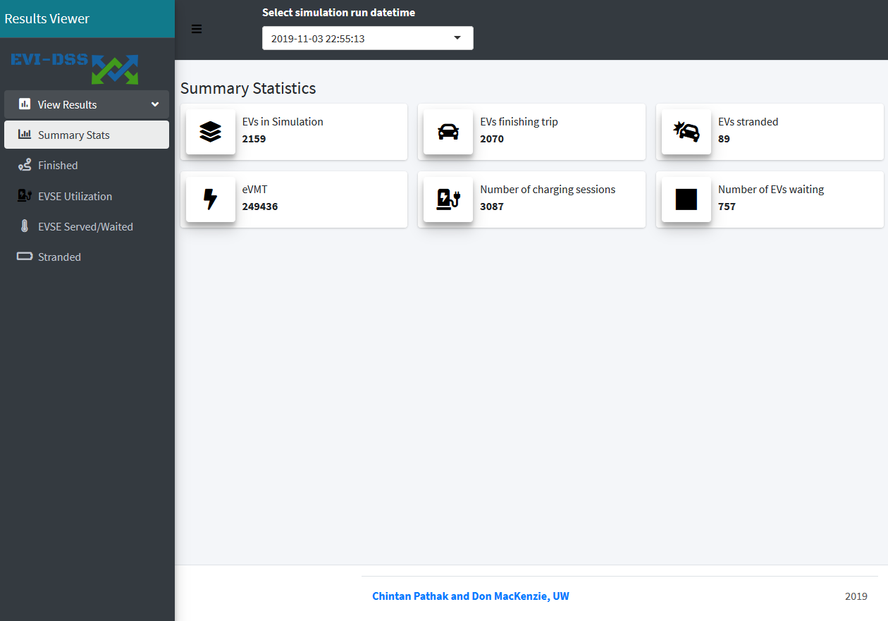
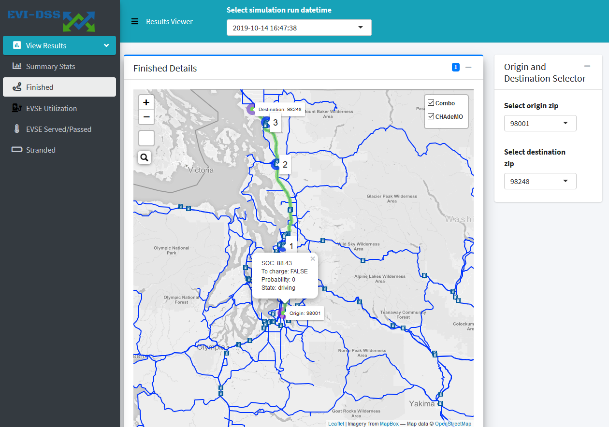
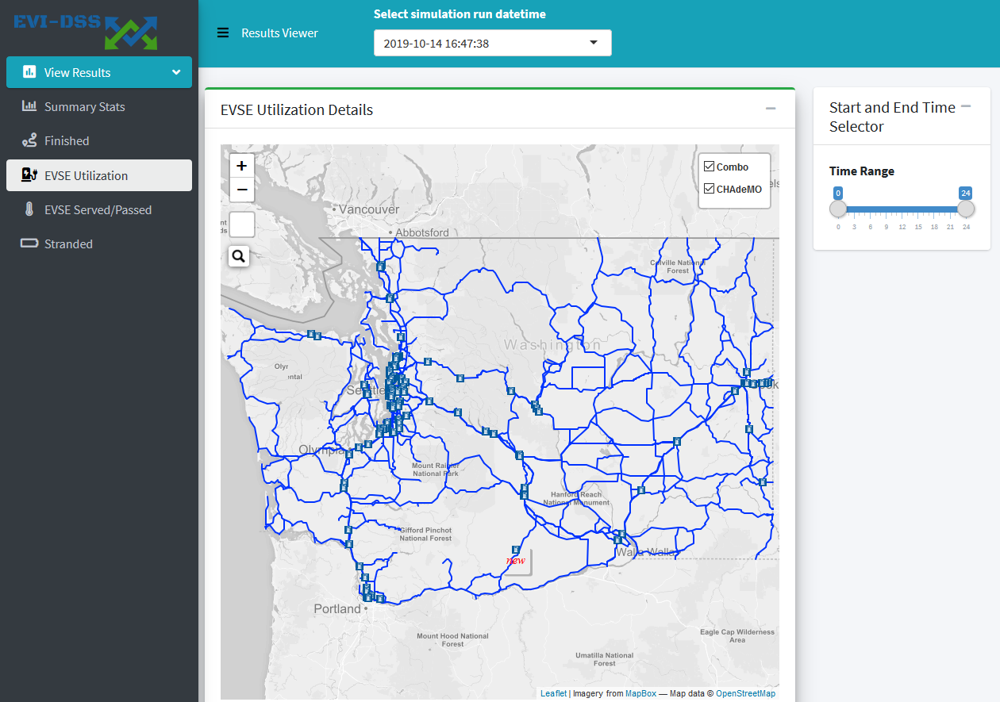
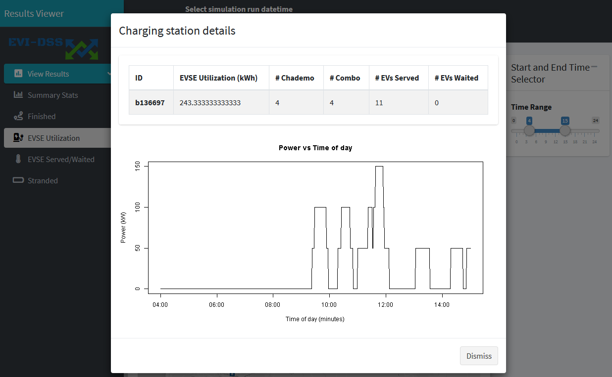

==============
Results Viewer
==============
The user gets an email at the registered email-id when a simulation has been successfully solved. The email contains the link to the Results Viewer. The Results Viewer allows the user to browse through the results of all the simulations that they submitted and have been solved. Being able to view the detailed output of several simulations allows the user to compare the performance of charging station deployment scenarios. The Summary Stats tab shown in :numref:`results_viewer_stats` is the first view to appear on a simulation run datetime selection from the dropdown. This is the time when the simulation was submitted.

.. _results_viewer_stats: 

    
    Results Viewer - Summary Stats Tab 

UI Details 
==========
After selecting the simulation datetime, the user has option to view the results on the following tabs:

Summary Stats
-------------
These stats presented on this tab represent the key statistics of interest for the simulated (consisting of as-built + proposed) EV infrastructure. "EVs in Simulation" is the count of EVs that were simulated for travel on a typical day. "EVs finishing trip" represent the number of EVs that reached their destination - i.e. finished their trip. "EVs stranded" represents the number of EVs that were stranded during the trip, i.e. they were out of charge due to lack of charging infrastructure along their charging route. "eVMT" refers to the electric vehicle miles travelled - this statistic does not include the added trip distance due to charging de-tours, but only counts the shortest path lenghts for EVs that finished their trips. "Number of charging sessions" represents the number of charging sessions as predicted by the model. "Number of EVs waiting" represents the number of EVs that waited at a charging station because it was occupied at the time they needed to charge. 

Finished
--------
The `Finished` tab allows one to look at the trajectory of the EVs for all the OD pairs that finished their trip. :numref:`results_viewer_finished` shows the trajectory of an OD pair based on selection from the origin and destination dropdown on the right. Besides the origin and destination, hte map shows the path taken by the EV using green dots. These dots represent the EV location at every timestep of the trip. Upon clicking a green dot the popup shows the EV info, from the :code:`ev_info` table, which includes the SOC, probability of charging, state etc. This can help debugging the underlying agent-based model and charging choice decision model. The trajectory also shows the charging stops made along the route (popups marked as 1, 2 and 3 in the path). 

.. _results_viewer_finished: 

    
    Results Viewer - Finished Tab 

EVSE Utilization
----------------
The `EVSE Utilization` tab shows the WA road network with the charging stations simulated, as built and newly proposed (marked as new) as be seen in the :numref:`results_viewer_evse_util`. 

.. _results_viewer_evse_util: 

    
    Results Viewer - EVSE Utilization Tab 

The user can select the time window from the slider on the right and click on any charging station (new and as-built) to view the utilization. :numref:`results_viewer_evse_util_modal` shows the utilization for the 
new proposed charging station for the time window selected. The table shows the predicted EVSE energy utilization in the simulated day, the number of Combo and Chademo plugs, as well the number of EVs served and EVs passed.

.. _results_viewer_evse_util_modal: 

    
    Results Viewer - EVSE Utilization Modal

EVSE Served/Waited
------------------
The `EVSE Served/Waited` tab shows the an overlay over the charging stations indicating the number of EVs served/waited. This allows for quick location of charging stations where the utilization is high and/or the charging stations where number of EVs waited is high. These charging stations can then be seen in detail using the `EVSE Utilization` tab to determine the time, and type of deficiency. 

Stranded
--------
The `Stranded` tab is similar to the `Finished` tab - only it shows the vehicles that were stranded during the trip - i.e. they were out of charge.

Implementation Details
======================
The code for the Results Viewer is hosted `here`_. The Results Viewer is a R Shiny web-app reading the data from the database. 

.. _here: https://github.com/chintanp/wsdot_evse_results_viewer