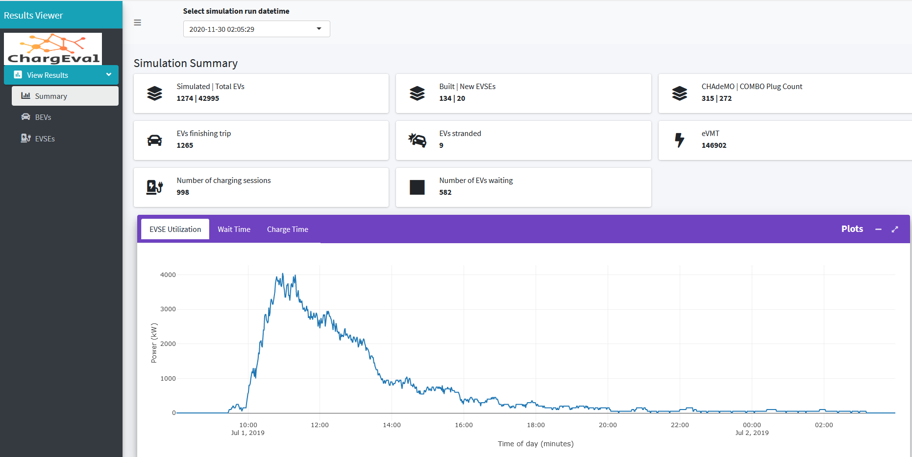
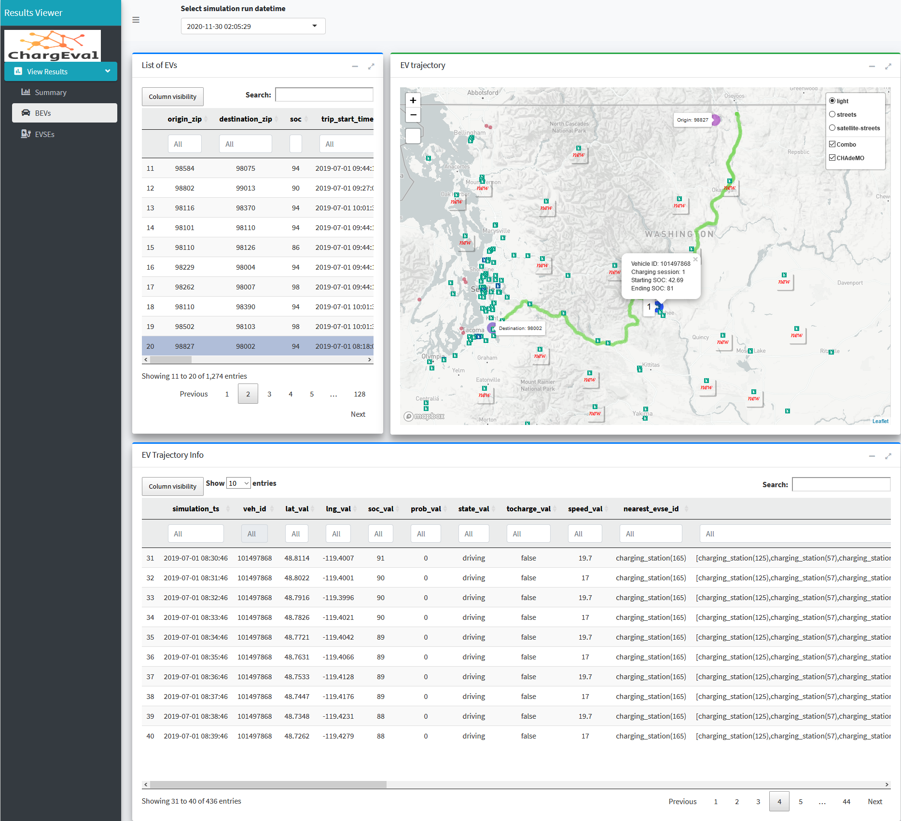

.. _res_view:

========================
Results Viewer (resview)
========================
The user gets an email at the registered email-id when a simulation has been successfully solved. The email contains the link to the Results Viewer. The Results Viewer allows the user to browse through the results of all the simulations that they submitted and have been solved. Being able to view the detailed output of several simulations allows the user to compare the performance of charging station deployment scenarios. The Summary Stats tab shown in :numref:`results_viewer_stats` is the first view to appear on a simulation run datetime selection from the dropdown. This is the time when the simulation was submitted. The videos below show a demonstrative use of the Results Viewer. 

.. raw:: html

    
    

    
<iframe width="560" height="315" src="https://www.youtube.com/embed/YISKcNf7tNw" frameborder="0" allow="accelerometer; autoplay; encrypted-media; gyroscope; picture-in-picture" allowfullscreen></iframe>

    
<iframe width="560" height="315" src="https://www.youtube.com/embed/X8sMYhzkijQ" frameborder="0" allow="accelerometer; autoplay; encrypted-media; gyroscope; picture-in-picture" allowfullscreen></iframe>

    
<iframe width="560" height="315" src="https://www.youtube.com/embed/wPgRRTq-67M" frameborder="0" allow="accelerometer; autoplay; encrypted-media; gyroscope; picture-in-picture" allowfullscreen></iframe>

    

Live Demo
=========
`Click here`_ to access the live demo of Results Viewer.

UI Details 
==========
After selecting the simulation datetime, the user has option to view the results on the following tabs:

Summary Stats
-------------
The stats presented on this tab represent the key statistics of interest for the simulated (consisting of as-built + proposed) EV infrastructure. 

- **Simulated EVs** is the count of EVs that were simulated for travel on a typical day. These trips are generated in the trip generation process described here :ref:`trip_gen`.

- **Total EVs** is the count of EVs in the state of WA, provided by WA DOL, desribed here :ref:`wa-bevs`.

- **Built EVSEs** is the count of EVSEs (already built) in the state of WA, provided by AFDC, described here :ref:`wa-evses`. 

- **New EVSEs** is the count of new EVSEs proposed as part of the analysis request. 

- **CHAdeMO | COMBO Plug Count** is the total number plugs including the built and proposed EVSEs. 

- **EVs finishing trip** represent the number of EVs that reached their destination - i.e. finished their trip. 

- **EVs stranded** represents the number of EVs that were stranded during the trip, i.e. they were out of charge due to lack of charging infrastructure along their charging route. 

- **eVMT** refers to the electric vehicle miles travelled - this statistic does not include the added trip distance due to charging de-tours, but only counts the shortest path lenghts for EVs that finished their trips. 

- **Number of charging sessions** represents the number of charging sessions as predicted by the model.

- **Number of EVs waiting** represents the number of EVs that waited at a charging station because it was occupied at the time they needed to charge. 

Besides the stats, the tab also shows the graphs of:

- **EVSE Utilization**: This is the plot of the total EVSE utilization across the state over the simulated time-period.

- **Wait Time Distribution**: This shows the waiting time distribution for the waiting sessions throughout the day for all the charging stations. 

- **Charge Time Distribution**: This shows the charging time (assuming constant power charge upto 80% from the SOC when charging started) distribution for the charging sessions throughout the day for all the charging stations. 

.. _results_viewer_stats: 

    
    Results Viewer - Summary Stats Tab 

BEVs
----

The BEVs tab shows the detailed informatiion about EVs in our simulation. The components in the BEVs tab include the following:

- **List of EVs**: This table contains columns specifying the trip details like origin, destination and trip start time as well as vehicle specific details like the vehicle id, city and county of registration, model year, make, range, capacity etc. The table can be searched and filtered on any of the columns, so it is very easy to say look up EVs from a particular zip code, or particular make etc. Clicking on a row in the table shows the trajectory of the EV on its journey from origin zip to the destination zip on the "EV trajectory" map. 

- **EV trajectory**: The adjoining card, EV trajectory, shows the charging stations on the map in toggleable layers, i.e. CHAdeMO and Combo can be both selected or one or none. It also shows the new charging stations in the simulation. When a row in the "List of EVs" table is clicked, the trajectory is shown on the map as points. The points represent the location of the EV as recorded in the database, at every timestep (1 minute at the time of this writing). Moving the mouse over the trajectory markers shows a popup with the EV states at the instant. This is helpful in debugging the simulation, as well as understanding the exact path taken by the EV during the trip. The trajectory also shows the various charging stops made by the EV during the trip. 

- **EV Trajectory Info**: The EV Trajectory Info table shows the EV states in a table at each timestep, for the clicked row in the "list of EVs" table. 

.. _results_viewer_bevs: 

    
    Results Viewer - BEVs Tab 

EVSEs
-----

The EVSEs tab shows the details about all the EVSE agents in the simulations. The tab has the following components:

- **List of DCFCs**: This table lists all the vital information related to the EVSEs including the EVSE id, the number of fast charging plugs, connector_code (whether CHAdeMO or Combo or both), the number of EVSEs served and number of EVSEs waited etc. The table can searched and filtered for any of the columns and the table can be exported to a csv or printed. Clicking on a row of the table, displays the relevant charging and waiting sessions in the adjoining table, and shows marker at the location of the charger in the "EVSE Utilization Details" map below.  

- **Charging Sessions / Waiting Sessions**: This card shows two tabs, namely charging sessions and waiting sessions. These are populated when the user clicks a certain row in the "List of DCFCs" table. Each row representing a charging session, shows the time of start and end as well as well as the vehicle id and starting and ending SOC of the charged vehicle.  Waiting sessions tab shows the waiting start and end time, as well as the vehicle ID and SOC of the waiting vehicle.

- **EVSE Utilization Details**: The map shows markers at the locations of charging stations, separating the newly proposed one. The chargers are overlaid with circles indicating the number of vehicles served and number of vehicle waited. On clicking a particular charging station, a popup modal shows the power draw profile as well as the total energy consumption for the charging station. The overlay circles and profile can be filtered for a particular time interval by using the "Start and End Time Selector" slider. The overlaid circle layers can be toggled between waiting and serving by the corresponding radio buttons on the left. 

.. _results_viewer_evses: 

    
    Results Viewer - EVSEs Tab 

Implementation Details
======================
The code for the Results Viewer is hosted `here`_. The Results Viewer is a R Shiny web-app reading the data from the database. 

Redash
======
`Redash`_ is a browser-based data analysis and visualization tool that can help with comparing the results. We can add our database as the datasource in Redash and write parameterized SQL queries that help us compare the results across simulations. An example can be seen in the video below. Redash can be used as a paid online service or using a `free and open-source self-hosted deployment`_. 

.. raw:: html

    <iframe width="560" height="315" src="https://www.youtube.com/embed/8ud7pJlq8H4" frameborder="0" allow="accelerometer; autoplay; encrypted-media; gyroscope; picture-in-picture" allowfullscreen></iframe>

.. _here: https://github.com/chintanp/wsdot_evse_results_viewer
.. _Click here: https://cp84.shinyapps.io/res_view/
.. _free and open-source self-hosted deployment: https://redash.io/help/open-source/setup
.. _Redash: https://redash.io/
