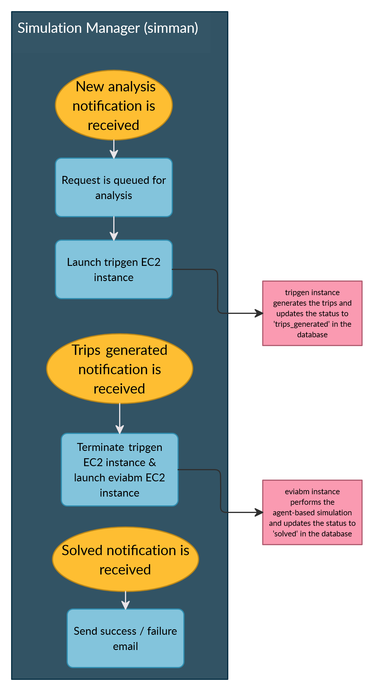

.. _sim_man:

===========================
Simulation Manager (simman)
===========================
The Simulation Manager is the controller in the ChargEval. The purpose of the Simulation Manager is to watch for the inserts into the database table 
:code:`analysis_record`. A record is inserted into this table whenever a user submits a charging station deployment scenario for analysis. The Simulation Manager receives the insert notification through the database trigger :code:`notify_new_order()` with the payload including the :code:`analysis_id` etc. and queues the analysis request for execution. The Simulation Manager process is shown in :numref:`sim_manager_flowchart`. 

.. _sim_manager_flowchart: 

    
    Simulation Manager Process Flowchart 

Simulation Manager and the sub-processes (in R and GAMA) all read the input data from the database and write the output to it. :code:`analysis_id` is passed between processes and all the relevant records from the database can be looked up using the :code:`analysis_id`. 

Implementation Details 
======================
The Simulation Manager is written in NodeJS as it supports asynchronous processes. The code is hosted `here`_. The NodeJS library `Bull`_ is used for implementing the queueing. Bull utilizes `Redis`_ as backend for storing the jobs in queue and their states. The queue can be monitored using an instance of `Bull Board`_ which tells us the status of the current queue, jobs being processed, waiting etc. 

.. _here: https://github.com/chintanp/wsdot_evse_sim_manager
.. _Bull: https://github.com/OptimalBits/bull
.. _Redis: https://redis.io/
.. _Bull Board: https://github.com/vcapretz/bull-board