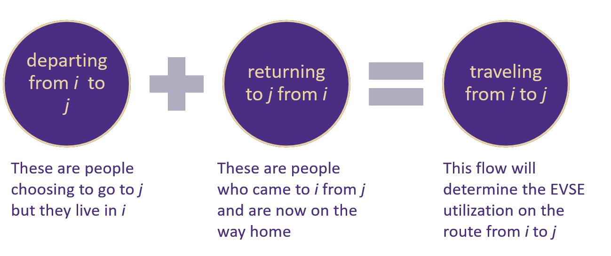
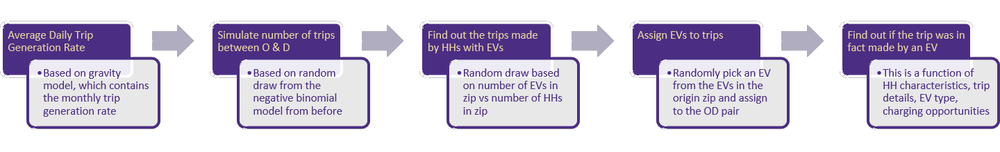

.. _trip_gen:

=========================
Trip Generation (tripgen)
=========================

.. detail the complete algorithm here (from the file generate_evtrip_scenarios.R)

The agent-based model simulates the EV trips happening in the state of WA in a day. The procedure to generate the trips is as follows: 

Estimate Long Distance Trips
============================

First the long-distance trips in WA are estimated using the :ref:`evi_dss:Long Distance Travel Demand Model`. The output of this model looks something like this (showing first 5 rows): 

.. (show output of head())

============ ========  =========     ========= 
Destination  Origin    ret           dep       
============ ========  =========     ========= 
98001        99019     0.01395        0.00950  
98001	     98326     0.01009        0.00024  
98001	     98433     4.98910        2.00689  
98001	     99110     0.00604        0.00147  
98001	     98277     0.16503        0.42239  
============ ========  =========     ========= 

where :code:`Origin` and :code:`Destination` refer to origin and destination zip codes. :code:`ret` and :code:`dep` refer to the average monthly trip generation rate for return and departure trips. 

:numref:`tripgen_split` shows the split between returning and departing trips, for any OD pair.

.. _tripgen_split: 

    Trip Generation Split

Estimate Daily Long Distance EV Trips
=====================================
    
:numref:`tripgen_process` shows the daily EV trip generation process. 

.. _tripgen_process: 

    Trip Generation Process

1. Calculate the daily trip generation rate from the monthly trip generation rate, for returning and departing vehicles [`1`_]. 

2. For both returning and departing vehicles, perform a random draw from Poisson Distribution, assuming the daily trip generation rate as the rate of occurrence to find the total vehicle trips per day [`2`_] .

3. For both returning and departing vehicle trips daily, perform a random draw from a Binomial Distrbution with the probability that the trip is made by an EV owning household [`3`_]. 

.. note::
    The probability calculation has an implicit assumption that one household has only one EV. In other words, number of EVs is equal to the number of EV owning households.

4. Based on the total count of returning and departing vehicle trips, group by vehicle source (destination for returning trips and origin for departing trips) to find the total EV requirement for a zip code. [`4`_]

5. From all the EVs available in the zip code, find the EVs that will actually make the trip on the given day by random sampling (without replacement) [`5`_].

6. Finally, perform a random draw from Binomial Distribution considering the probability of vehicle choice (using the :ref:`evi_dss:Vehicle Choice Decision Model`) [`6`_]. 

7. Collect all trips that happen, both returning and departing, and store them in the database with the relevant :code:`analysis_id`, so that they can be picked up by the :code:`eviabm` for performing trhe agent-based simulation.

.. _1: https://github.com/chintanp/wsdot_evse_update_states/blob/c2d4b2d8224dfd1996922ccd018ce7991889e2b1/R/
.. _2: https://github.com/chintanp/wsdot_evse_update_states/blob/c2d4b2d8224dfd1996922ccd018ce7991889e2b1/R/generate_evtrip_scenarios.R#L183
.. _3: https://github.com/chintanp/wsdot_evse_update_states/blob/c2d4b2d8224dfd1996922ccd018ce7991889e2b1/R/generate_evtrip_scenarios.R#L188
.. _4: https://github.com/chintanp/wsdot_evse_update_states/blob/c2d4b2d8224dfd1996922ccd018ce7991889e2b1/R/generate_evtrip_scenarios.R#L882
.. _5: https://github.com/chintanp/wsdot_evse_update_states/blob/c2d4b2d8224dfd1996922ccd018ce7991889e2b1/R/generate_evtrip_scenarios.R#L921
.. _6: https://github.com/chintanp/wsdot_evse_update_states/blob/c2d4b2d8224dfd1996922ccd018ce7991889e2b1/R/generate_evtrip_scenarios.R#L1265

